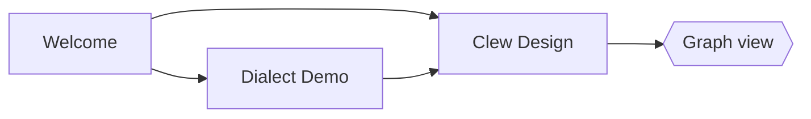

# Diagrams

Mermaid renders client-side in the preview. Obsidian's fence syntax works:

…as does jmarkdown's native form (which also rasterises for LaTeX/PDF
export, via mermaid-cli):

@begin(mermaid)
sequenceDiagram
	Editor->>Engine: note changed
	Engine->>Preview: rendered HTML
	Preview->>Preview: morphdom patch
@end(mermaid)

## TikZ

TikZ compiles at render time (LaTeX + dvisvgm) and caches an SVG next to
the note — so a figure of any complexity costs its compile **once**, and
every render after that is instant. This one is a real figure from a real
paper — "The incompleteness of classical mechanics" (*BJPS*) — and it is
genuinely three-dimensional: the whole scene is drawn in rotated x-y-z
coordinates, and each ring of point particles (a "gravitationally
equivalent decomposition" of the mass on the axis) is generated by a
`\foreach` loop spinning a particle pair around the *x*-axis, force
arrows and all. Switch to source mode to read it.

@begin(TiKZ)
\begin{tikzpicture}[>=latex, rotate around x=10,
  rotate around y=0, rotate around z=0]
  % Draw the axes
  \draw[<->] (-3,0,0) -- (2.5,0,0) node[anchor=west] {$x$};
  \draw[<->] (0,-2.5,0) -- (0,2.5,0) node[anchor=south] {$y$};
  \draw[<->] (0,0,-3) -- (0,0,3) node[anchor=north] {$z$};

  % First mass m_1
  \fill[black] (1,0,0) circle[radius=1pt];
  \draw[->] (1.7, 0.9, 0) node[anchor=west, scale=0.5] {Mass $m_1$}
      to[out=180, in=90] (1, 0.05, 0);

  \foreach \rot in {0,18,...,162} {
    \draw[rotate around x=\rot, very thin,
        arrows={-Latex[scale=0.6]}, lightgray]
        (0,0,0) -- ($ 0.985*(1,0,1) $);
    \fill[rotate around x=\rot] (1,0,1) circle[radius=1pt];

    \fill[rotate around x=\rot] (1,0,-1) circle[radius=1pt];
    \draw[very thin, rotate around x=\rot,
        arrows={-Latex[scale=0.6]}, lightgray]
        (0,0,0) -- ($ 0.985*(1,0,-1) $);
  }

  \draw[gray] (1,0,0) circle[radius=1, rotate around y=90];
  \draw[gray] (-2,0,0) circle[radius=1, rotate around y=90];
  \draw[gray] (-1.9,0,0) circle[radius=1.1, rotate around y=90];

  % Gravitational equivalents for m_2
  \foreach \rot in {0,18,...,162} {
    \draw[rotate around x=\rot, very thin,
        arrows={-Latex[scale=0.6]}, lightgray]
        (0,0,0) -- ($ 0.985*(-2,0,1) $);
    \fill[rotate around x=\rot] (-2,0,1) circle[radius=1pt];

    \fill[rotate around x=\rot] (-2,0,-1) circle[radius=1pt];
    \draw[very thin, rotate around x=\rot,
        arrows={-Latex[scale=0.6]}, lightgray]
        (0,0,0) -- ($ 0.985*(-2,0,-1) $);
  }

  % Gravitational equivalents for m_2
  \foreach \rot in {0,18,...,162} {
    \draw[rotate around x=\rot, very thin,
        arrows={-Latex[scale=0.6]}, lightgray]
        (0,0,0) -- ($ 0.975*(-1.9,0,1.1) $);
    \fill[rotate around x=\rot] (-1.9,0,1.1) circle[radius=1pt];

    \fill[rotate around x=\rot] (-1.9,0,-1.1) circle[radius=1pt];
    \draw[very thin, rotate around x=\rot,
        arrows={-Latex[scale=0.6]}, lightgray]
        (0,0,0) -- ($ 0.975*(-1.9,0,-1.1) $);
  }

  % Unit mass at the origin
  \fill (0,0,0) circle[radius=1pt];
  \draw[->] (-0.75, 1.75,0) node[scale=0.5,anchor=east] {Unit mass at the origin}
      to[out=0, in=110] (-.05,.05,0);

  \fill (-2,0,0) circle[radius=2pt];
  \draw[->] (-1.5,0,2.75) node[scale=0.5, anchor=west] {Mass $m_2$}
  to[out=135, in=270] (-2.5,0,1.2)
  to[out=90, in=195] (-2.1,0,0.05);
\end{tikzpicture}
@end(TiKZ)

## MetaPost

MetaPost's strength is that a figure is a *program*: positions are
**solved**, not placed. This abacus-machine flowchart comes from
`ep-figures.mp`, a figure library the owner wrote in 1998, and shows the
classic `boxes` package at work — box positions are declared as
*equations* (`b2.n - b1.s = (0,-1u)`) and MetaPost solves the layout;
the labels are set by TeX (`btex $q^+$ etex`); and every arrow, the long
return edge and the self-loop included, is trimmed against the box
outlines with `cutbefore`/`cutafter`.

@begin(metapost){width='45%'}
input boxes

vardef connect(suffix a,b) =
  drawarrow a.c..b.c cutbefore bpath.a cutafter bpath.b;
enddef;

vardef arrowin@# =
  drawarrow @#.c shifted (0,1.75u)..@#.c cutafter bpath.@#;
enddef;

vardef arrowout@# =
  drawarrow @#.c..@#.c shifted (0,-1.75u) cutbefore bpath.@#;
enddef;

beginfig(14);
 u:=18;
 path p[];
 boxit.b1(btex \setbox0=\hbox{copy $[1]$}\relax
               \vbox{\copy0\hbox to \wd0{\hfil into $p$\hfil}}etex);

 boxit.b2(btex $g$ etex);
 circleit.b3(btex $3^-$ etex);
 circleit.a4(btex $p^-$ etex);
 circleit.c4(btex $q^+$ etex);

 boxit.a5(btex \setbox0=\hbox{empty $q$}\relax
               \vbox{\copy0\hbox to\wd0{\hfil into 2\hfil}}etex);

 boxit.c5(btex \setbox0=\hbox{copy $[q]$}\relax
               \vbox{\copy0\hbox to\wd0{\hfil into 2\hfil}}etex);

 boxit.c6(btex \setbox0=\hbox{copy $[p]$}\relax
               \vbox{\copy0\hbox to\wd0{\hfil into 1\hfil}}etex);
 b1.c=(0,0);
 b2.n - b1.s = b3.n - b2.s = (0,-1u);
 b3.c - a4.c = (1.5u,2u);
 a4.c - a5.n = (1.5u,1.5u);
 b3.c - c4.c = (-1.5u,2u);
 c4.s - c5.n = (0,1u);
 c5.s - c6.n = (0,1u);
 drawboxed(b1,b2,b3);
 drawboxed(a4,a5);
 drawboxed(c4,c5,c6);

 arrowin.b1;
 connect(b1,b2);
 connect(b2,b3);

 p1 = b3.c..a4.c cutbefore bpath.b3 cutafter bpath.a4;
 label.top(btex $e$ etex, point .5*length p1 of p1);
 drawarrow p1;
 drawarrow a4.c{dir 260}..a4.c+(.75u,-.75u)..{left}a4.e %
   cutbefore bpath.a4 cutafter bpath.a4;

 p2 = a4.c..a5.n cutbefore bpath.a4 cutafter bpath.a5;
 label.top(btex $e$ etex, point .5*length p2 of p2);
 drawarrow p2;
 arrowout.a5;

 connect(b3,c4);
 connect(c4,c5);
 connect(c5,c6);

 z1 = c6.se shifted (0,-.75u);
 z2 = c5.e shifted (1u,0);

 drawarrow c6.s{down}..{right}z1..tension1.5..{left}b2.e;
endfig;
end.
@end(metapost)

Both need a TeX toolchain installed; the SVGs cache in `TiKZ/` and
`MetaPost/` folders beside this note, so a vault renders its figures
even on a machine with no TeX at all.
