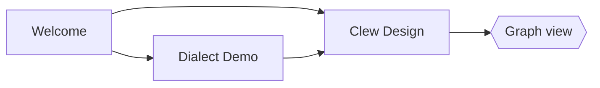

# Diagrams

Mermaid renders client-side in the preview. Obsidian's fence syntax works
— and while the cursor is inside one of these blocks, in source mode or
live edit, a pane beside it shows the diagram as you type:



…as does jmarkdown's native form (which also rasterises for LaTeX/PDF
export, via mermaid-cli):

@begin(mermaid)
sequenceDiagram
	Editor->>Engine: note changed
	Engine->>Preview: rendered HTML
	Preview->>Preview: morphdom patch
@end(mermaid)

## TikZ

TikZ is typeset **here**, in the preview, by a real LaTeX: pdfTeX,
LuaTeX, MetaPost and dvisvgm compiled to WebAssembly
([mp-tikz-wasm](https://github.com/jmckalex/mp-tikz-wasm)). Nothing is
installed, nothing is shelled out to, and nothing is written into the
vault — a figure costs its typesetting **once** and every render after
that comes from a content-addressed cache. Because it is the real
engine, every PGF/TikZ library works, shadings and gradients included,
and a figure that asks for a graph-drawing layout gets LuaTeX. This one
is a real figure from a real
paper — "The incompleteness of classical mechanics" (*BJPS*) — and it is
genuinely three-dimensional: the whole scene is drawn in rotated x-y-z
coordinates, and each ring of point particles (a "gravitationally
equivalent decomposition" of the mass on the axis) is generated by a
`\foreach` loop spinning a particle pair around the *x*-axis, force
arrows and all. Switch to source mode to read it.

@begin(TiKZ)
\begin{tikzpicture}[>=latex, rotate around x=10,
  rotate around y=0, rotate around z=0]
  % Draw the axes
  \draw[<->] (-3,0,0) -- (2.5,0,0) node[anchor=west] {$x$};
  \draw[<->] (0,-2.5,0) -- (0,2.5,0) node[anchor=south] {$y$};
  \draw[<->] (0,0,-3) -- (0,0,3) node[anchor=north] {$z$};

  % First mass m_1
  \fill[black] (1,0,0) circle[radius=1pt];
  \draw[->] (1.7, 0.9, 0) node[anchor=west, scale=0.5] {Mass $m_1$}
      to[out=180, in=90] (1, 0.05, 0);

  \foreach \rot in {0,18,...,162} {
    \draw[rotate around x=\rot, very thin,
        arrows={-Latex[scale=0.6]}, lightgray]
        (0,0,0) -- ($ 0.985*(1,0,1) $);
    \fill[rotate around x=\rot] (1,0,1) circle[radius=1pt];

    \fill[rotate around x=\rot] (1,0,-1) circle[radius=1pt];
    \draw[very thin, rotate around x=\rot,
        arrows={-Latex[scale=0.6]}, lightgray]
        (0,0,0) -- ($ 0.985*(1,0,-1) $);
  }

  \draw[gray] (1,0,0) circle[radius=1, rotate around y=90];
  \draw[gray] (-2,0,0) circle[radius=1, rotate around y=90];
  \draw[gray] (-1.9,0,0) circle[radius=1.1, rotate around y=90];

  % Gravitational equivalents for m_2
  \foreach \rot in {0,18,...,162} {
    \draw[rotate around x=\rot, very thin,
        arrows={-Latex[scale=0.6]}, lightgray]
        (0,0,0) -- ($ 0.985*(-2,0,1) $);
    \fill[rotate around x=\rot] (-2,0,1) circle[radius=1pt];

    \fill[rotate around x=\rot] (-2,0,-1) circle[radius=1pt];
    \draw[very thin, rotate around x=\rot,
        arrows={-Latex[scale=0.6]}, lightgray]
        (0,0,0) -- ($ 0.985*(-2,0,-1) $);
  }

  % Gravitational equivalents for m_2
  \foreach \rot in {0,18,...,162} {
    \draw[rotate around x=\rot, very thin,
        arrows={-Latex[scale=0.6]}, lightgray]
        (0,0,0) -- ($ 0.975*(-1.9,0,1.1) $);
    \fill[rotate around x=\rot] (-1.9,0,1.1) circle[radius=1pt];

    \fill[rotate around x=\rot] (-1.9,0,-1.1) circle[radius=1pt];
    \draw[very thin, rotate around x=\rot,
        arrows={-Latex[scale=0.6]}, lightgray]
        (0,0,0) -- ($ 0.975*(-1.9,0,-1.1) $);
  }


  % Unit mass at the origin
  \fill (0,0,0) circle[radius=1pt];
  \draw[->] (-0.75, 1.75,0) node[scale=0.5,anchor=east] {Unit mass at the origin}
      to[out=0, in=110] (-.05,.05,0);

  \fill (-2,0,0) circle[radius=2pt];
  \draw[->] (-1.5,0,2.75) node[scale=0.5, anchor=west] {Mass $m_2$}
  to[out=135, in=270] (-2.5,0,1.2)
  to[out=90, in=195] (-2.1,0,0.05);
\end{tikzpicture}
@end(TiKZ)

## MetaPost

MetaPost's strength is that a figure is a *program*: positions are
**solved**, not placed. This abacus-machine flowchart comes from
`ep-figures.mp`, a figure library the owner wrote in 1998, and shows the
classic `boxes` package at work — box positions are declared as
*equations* (`b2.n - b1.s = (0,-1u)`) and MetaPost solves the layout;
the labels are set by TeX (`btex $q^+$ etex`); and every arrow, the long
return edge and the self-loop included, is trimmed against the box
outlines with `cutbefore`/`cutafter`.

@begin(metapost){width='45%'}
input boxes

vardef connect(suffix a,b) =
  drawarrow a.c..b.c cutbefore bpath.a cutafter bpath.b;
enddef;

vardef arrowin@# =
  drawarrow @#.c shifted (0,1.75u)..@#.c cutafter bpath.@#;
enddef;

vardef arrowout@# =
  drawarrow @#.c..@#.c shifted (0,-1.75u) cutbefore bpath.@#;
enddef;

beginfig(14);
 u:=18;
 path p[];
 boxit.b1(btex \setbox0=\hbox{copy $[1]$}\relax
               \vbox{\copy0\hbox to \wd0{\hfil into $p$\hfil}}etex);

 boxit.b2(btex $g$ etex);
 circleit.b3(btex $3^-$ etex);
 circleit.a4(btex $p^-$ etex);
 circleit.c4(btex $q^+$ etex);

 boxit.a5(btex \setbox0=\hbox{empty $q$}\relax
               \vbox{\copy0\hbox to\wd0{\hfil into 2\hfil}}etex);

 boxit.c5(btex \setbox0=\hbox{copy $[q]$}\relax
               \vbox{\copy0\hbox to\wd0{\hfil into 2\hfil}}etex);

 boxit.c6(btex \setbox0=\hbox{copy $[p]$}\relax
               \vbox{\copy0\hbox to\wd0{\hfil into 1\hfil}}etex);
 b1.c=(0,0);
 b2.n - b1.s = b3.n - b2.s = (0,-1u);
 b3.c - a4.c = (1.5u,2u);
 a4.c - a5.n = (1.5u,1.5u);
 b3.c - c4.c = (-1.5u,2u);
 c4.s - c5.n = (0,1u);
 c5.s - c6.n = (0,1u);
 drawboxed(b1,b2,b3);
 drawboxed(a4,a5);
 drawboxed(c4,c5,c6);

 arrowin.b1;
 connect(b1,b2);
 connect(b2,b3);

 p1 = b3.c..a4.c cutbefore bpath.b3 cutafter bpath.a4;
 label.top(btex $e$ etex, point .5*length p1 of p1);
 drawarrow p1;
 drawarrow a4.c{dir 260}..a4.c+(.75u,-.75u)..{left}a4.e %
   cutbefore bpath.a4 cutafter bpath.a4;

 p2 = a4.c..a5.n cutbefore bpath.a4 cutafter bpath.a5;
 label.top(btex $e$ etex, point .5*length p2 of p2);
 drawarrow p2;
 arrowout.a5;

 connect(b3,c4);
 connect(c4,c5);
 connect(c5,c6);

 z1 = c6.se shifted (0,-.75u);
 z2 = c5.e shifted (1u,0);

 drawarrow c6.s{down}..{right}z1..tension1.5..{left}b2.e;
endfig;
end.
@end(metapost)

## Obsidian's fence, too

An Obsidian vault writes TikZ as a ` ```tikz ` fence (the TikZJax
plugin's shape), and Clew renders it — bodies in that dialect, with
their own `\usepackage` lines and `\begin{document}`, included. Declare
the libraries the picture needs, the way a standalone document would:

```tikz libraries="arrows.meta,positioning"
\node[draw,circle,fill=blue!15] (a) at (0,0) {$a$};
\node[draw,circle,fill=orange!25] (b) at (2.4,0) {$b$};
\draw[-{Stealth[length=3mm]},thick] (a) -- node[above]{$f$} (b);
```

MetaPost has no Obsidian convention to follow, so Clew gives it the
matching one — ` ```metapost `, for a figure that wants no TeX at all:

```metapost
z1 = (0,0); z2 = (60,34); z3 = (120,0);
z4 = 0.5[z1,z3];                 % a point solved, not placed
draw z1 .. z2 .. z3 withpen pencircle scaled 1.2 withcolor (0.2,0.35,0.6);
draw z2 -- z4 dashed evenly;
dotlabel.bot(btex $z_4$ etex, z4);
dotlabel.top(btex $z_2$ etex, z2);
```

## Showing the source instead

Every one of these blocks takes `show=` on its opening line. `show=code`
displays the source as a highlighted code block and typesets nothing —
for a note *about* TikZ rather than one that draws with it. `show=both`
shows the source and then the figure, the way a tutorial reads; the
default is `show=figure`. The bare words `code` and `both` mean the same
thing, and the same words work on `:::TiKZ{show=code}` and
`@begin(metapost){show=both}`:

```tikz both
\draw[thick,fill=blue!10] (0,0) -- (2,0) -- (1,1.5) -- cycle;
\node at (1,0.5) {$\triangle$};
```

In source mode the fences are highlighted in their own languages — TeX
for ` ```tikz `, ` ```latex ` and ` ```tex `, MetaPost for
` ```metapost ` — so the code reads the same in both panes.

## LaTeX and plain TeX, too

The same engines typeset **any** LaTeX, not just pictures. A ` ```latex `
fence holds a snippet — a paragraph, an `align`, a table, a theorem —
which is wrapped in a `standalone` document as wide as it needs to be
(with `amsmath` and `amssymb` loaded), run through LuaLaTeX, and shown
as the page LaTeX lays out, cropped to the ink. A fence that says
`\documentclass` is a complete document and is typeset as written, one
SVG per page — page numbers included. The SVG is cropped to the ink, so
an article's folio at the foot of the page makes every page as tall as
the paper; a document meant as a snippet wants `\pagestyle{empty}`.

```latex
Maxwell's equations, in differential form:
\begin{align}
  \nabla \cdot \mathbf{E} &= \frac{\rho}{\varepsilon_0} &
  \nabla \times \mathbf{E} &= -\frac{\partial \mathbf{B}}{\partial t} \\
  \nabla \cdot \mathbf{B} &= 0 &
  \nabla \times \mathbf{B} &= \mu_0 \mathbf{J}
    + \mu_0 \varepsilon_0 \frac{\partial \mathbf{E}}{\partial t}
\end{align}
```

A ` ```tex ` fence is plain TeX — Knuth's, with the e-TeX extensions —
and gets its `\bye` if it forgot one. It keeps its page number too, so
a snippet wants `\nopagenumbers`:

```tex
\nopagenumbers
\centerline{\bf Plain \TeX\ still works:
  $\displaystyle\sum_{n=1}^\infty {1 \over n^2} = {\pi^2 \over 6}$}
```

## Sharing a preamble: fragments

Figures in one note usually want the same preamble — your own macros, a
colour, a package. Rather than copy it into every fence, write it once in
**Settings → TeX fragments**, give it a name, and ask for it by name:

```latex clew-fragments='math macros'
For $X \sim \mathcal{N}(0,1)$: $\E[X] = 0$, and
$\argmax_{x \in \R} e^{-x^2} = 0$.
```

Nothing in that fence defines `\E`, `\R` or `\argmax` — they come from
this vault's **math macros** fragment, which you can read and change in
Settings. A fragment can carry the packages it needs, too: that one
starts with `\usepackage{amsmath,amssymb}`. A ` ```latex ` snippet gets
those two from Clew anyway, but a TikZ picture is wrapped by the figure
library and gets neither — so a fragment used by both brings its own, or
`\DeclareMathOperator` and `\mathbb` are undefined in the picture.

Several names are separated by commas and are inserted in the order you
write them:

```tikz clew-fragments='math macros, diagram colours'
\fill[clewink] (0,0) circle (0.35) node[right=10pt] {$\R$};
\draw[->,thick,clewink] (1.6,0) -- (3.2,0) node[right] {$\E[X]$};
```

There are two lists. The **global** fragments follow you from vault to
vault; **this vault's** travel with the vault, which is why the two
figures above draw the same on any machine that opens this demo. Where
both define a name, the vault's wins. Edit a fragment and every figure
using it is typeset again; ask for a name nothing defines and Clew says
which name it could not find rather than typesetting the figure without
it.

## In the note's own typeface

A figure's text is normally Latin Modern, TeX's own face. `font=note` sets
it in the face this note is read in instead — Avenir Next on a Mac — and
the SVG carries real, selectable text in an embedded subset of that font
rather than glyph outlines. It works on ` ```tikz `, ` ```latex ` and
` ```tex ` (the figure moves to LuaTeX, which is what loads OpenType fonts),
and needs the `opentype` bundle of the wasm TeX, so it is a little slower
the first time:

```latex font=note
A paragraph set in the note's face: regular, \textbf{bold},
\textit{italic} --- with maths, $e^{i\pi} + 1 = 0$, still in Latin Modern.
```

```tikz font=note
\node[draw,rounded corners,fill=blue!8] (a) at (0,0) {a labelled node};
\node[draw,rounded corners,fill=orange!12] (b) at (4.2,0) {in the same face};
\draw[->,thick] (a) -- node[above] {\textit{as the prose}} (b);
```

Exports part company here, on purpose. A **LaTeX or PDF export** runs
your own jmarkdown configuration, where `@begin(TiKZ)` becomes a native
`tikzpicture` in the document — a true vector figure in the document's
own fonts, which is what a typeset paper wants (and which needs your TeX
installation); the fences — ` ```tikz `, ` ```latex ` and the rest — are
Clew's preview syntax and come out as code blocks there. A **website
export** bakes every figure to SVG in the page, so a published site
carries no engine at all.
