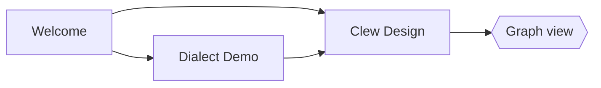

# Diagrams

Mermaid renders client-side in the preview. Obsidian's fence syntax works:

…as does jmarkdown's native form (which also rasterises for LaTeX/PDF
export, via mermaid-cli):

@begin(mermaid)
sequenceDiagram
	Editor->>Engine: note changed
	Engine->>Preview: rendered HTML
	Preview->>Preview: morphdom patch
@end(mermaid)

## TikZ

TikZ compiles at render time (LaTeX + dvisvgm) and caches an SVG next to
the note:

@begin(TiKZ)
\begin{tikzpicture}[scale=1.1]
\draw[thick,->] (0,0) -- (3,0) node[right] {$x$};
\draw[thick,->] (0,0) -- (0,2.2) node[above] {$y$};
\draw[blue,very thick,domain=0:2.8,smooth] plot (\x, {0.25*\x*\x});
\node[blue] at (2.2,1.9) {$y = x^2/4$};
\end{tikzpicture}
@end(TiKZ)

## MetaPost

@begin(metapost)
beginfig(1);
path tri; tri := (0,0)--(70,45)--(140,0)--cycle;
fill tri withcolor (0.55,0.5,0.8);
draw tri withpen pencircle scaled 1.2;
endfig;
end.
@end(metapost)

Both need a TeX toolchain installed; the SVGs cache in `TiKZ/` and
`MetaPost/` folders beside this note.
