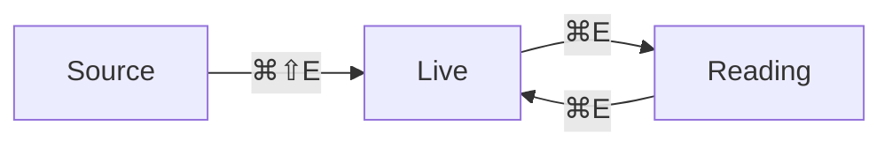

# Live Edit

*Live edit* is the editor with the markup put away: this note, opened
with *⌘⇧E*, shows its headings as headings, its maths typeset, its
diagram drawn — and the moment the cursor touches a construct, that
construct shows its source again, exactly as source mode would. Nothing
about the file changes; live edit is source mode wearing a costume.

{{TOC}}

## The rule

A construct is *revealed* when any selection touches it, and
*concealed* otherwise. Walk the cursor through *this strong phrase*
with the arrow keys: the asterisks appear as you enter and go as you
leave. Each construct is judged on its own — in *a strong phrase with
/italics/ inside* the italics stay concealed until the cursor reaches
them. Settings → Live edit can widen the rule to the *whole line*.

Entering a line never changes its height: a heading keeps its size, a
list its indent, a callout its tint, whichever state it is in.

## Inline

Every style of the dialect: *strong*, **intense**, /italic/,
__underline__, ==highlighted==, ~struck~, H_2O and x^{10}, `code`, and
maths $e^{i\pi} + 1 = 0$ typeset in place. Links follow on a click —
[[Welcome]], [[Callouts|an aliased link]], [a web link](https://jmckalex.org)
— and *⌥-click* puts the cursor in one instead; hover one to peek at it. Put the cursor in a formula and its source shows, with the rendering beside it as you type. A cross-reference like @cref[eq-pythagoras] — the numbered equation under *Blocks* below — shows the number it will print, jumps on a click and previews on a hover ([[Math and Theorems]] has more). Tags like #guide open a
search. A footnote becomes its number,[fn: Hover the number to read it.] however long it is.[^long: A note can run to several paragraphs.

- It can hold a list,
- or maths, $e^{i\pi} = -1$.

Click its number to open it all.] On a wide pane both notes also sit in the margin beside this paragraph, in reading mode too.
a citation its author and year
\cite{alexander2023}, and a `{{…}}` variable a chip: {{title}}. Today is :today. A block id
becomes a small badge — click it to copy a link to its block. ^live-inline

## Lines

- Bullets are drawn as bullets
  - and nested ones as nested ones
- [ ] a task: click the box, or put the cursor on it and press *⌘↩*
- [x] a finished task
1. numbered items keep their numbers

> A quote keeps its bar.

> [!tip]- A folded tip (click the chevron)
> The fold is how you are LOOKING at the note, not a change to it: the
> `-` in the source is only where it starts.

>> Centred text <<

Term:: a description-list term is set in bold.

## Blocks

| Construct | In live edit | Try |
| :--- | :---: | ---: |
| *table* | a real table | click a cell and type |
| `$$…$$` | typeset | click it |
| mermaid | drawn by the engine | hover it, click *Edit source* |

A table stays a table while you edit it: click a cell and type, *Tab* and
*Enter* walk the cells (and add a row at the end), right-click for rows,
columns and alignment, *Esc* for the source. Practise here:

| Fruit | Colour | Count |
| --- | --- | --- |
| apple | red | 3 |
| pear | green | 5 |

A table needs no header: rows of pipes on their own are a table too, and
every row is an ordinary one.

| Mercury | 0.39 AU |
| Venus | 0.72 AU |

$$
\newcommand{\half}{\frac{1}{2}}
\int_0^1 x \, dx = \half
$$

@begin(equation){#eq-pythagoras}
a^2 + b^2 = c^2
@end(equation)

***

![[clew-gradient.png|240]]



```js
// Code keeps its source; the fence lines become a label and a Copy button.
const mode = 'live';
```

:::theorem[Concealment]
A directive's opening and closing lines become a captioned frame; the
body is ordinary markdown, so typing in it keeps the frame.
:::

:::TeX
\LaTeX-only content is shown dimmed: it renders in a LaTeX export only.
:::

![[Callouts#Folding]]

Engine-rendered blocks — the mermaid diagram above, the embed just there,
queries, maps, PDFs — are the engine's own rendering in a small frame,
exactly what reading mode shows, refusals included. Hover one and its
*Edit source* icon appears at the upper-right corner: click it, or move
into the block with the arrow keys, to edit its source. A click on the
drawing itself is the drawing's — a map pans, a board drags.

## The toolbar

In live edit a toolbar sits above the note: text styles (with the
dialect's names — *strong* is `*text*` here), block style, lists,
inserts with small forms for links, tables, callouts, code, maths and
diagrams, and the mode switch. It never takes the cursor away; *⌥⇧T*
reaches it from the keyboard. Select some text and a smaller bubble
offers the text styles. Settings → Editor toolbar decides when it shows
and which groups it holds.

## The // menu

Type `//` at the start of a line, or after a space, and the Format menu
drops down: keep typing to filter it (`//head 2`), *Enter* to apply,
*Esc* to leave the slashes as text. It works in source mode and in a
table cell too (inline styles only there). Two slashes because one is
the dialect's italic; `https://` and code never open it. Settings →
Editor toolbar turns it off.

See also: [[Editing]], [[Reading Mode]], [[Settings and Hotkeys]].
